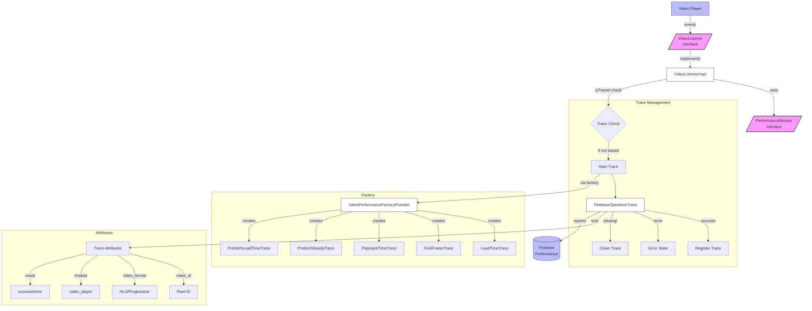

# Performance Tracing Guide

This document explains **how video-related performance is instrumented** in the Yral Android application (Kotlin). It is intended for developers who need to:

* understand the existing infrastructure,
* debug/verify traces in Firebase Performance, or
* add new performance measurements.

---

## 1. Terminology

| Term | Description |
| ---- | ----------- |
| **Trace** | A named timer created in Firebase Performance that starts and stops around an app flow. Exposed through `FirebaseOperationTrace`. |
| **Metric** | Numeric measurement attached to a trace – e.g. *buffering_count*. |
| **Attribute** | Key-value metadata attached to a trace – e.g. *video_id*, *video_format*. |

### Common Constants

The `PerformanceConstants` object defines standard keys and values used across all traces:

```kotlin
// Attribute keys
const val RESULT_KEY = "result"
const val URL_KEY = "url"
const val MODULE_KEY = "module"
const val OPERATION_KEY = "operation"

// Result values
const val SUCCESS_VALUE = "success"
const val ERROR_VALUE = "error"

// Common metrics
const val DURATION_MS = "duration_ms"
const val COUNT_METRIC = "count"
```

---

## 2. Trace catalogue

| Trace name (Firebase) | Kotlin enum / constant | When it starts | When it ends |
| --------------------- | ---------------------- | -------------- | ------------ |
| `VideoStartup` | `TraceType.LOAD_TRACE` | Player instance is **setup** (network request on HLS / progressive starts) | First `onBuffer()` OR any error / manual cleanup |
| `FirstFrame` | `TraceType.FIRST_FRAME_TRACE` | Right after player setup | When the first decoded frame is ready (`onReady()`) |
| `VideoPlayback` | `TraceType.PLAYBACK_TRACE` | Immediately before playback starts (`onPlayBackStarted()`) | When the video ends (`onEnd()`) OR is stopped / errored |
| `VideoStartup_prefetch` | `PrefetchTraceType.LOAD_TRACE` | When a video is **prefetched** in background | First buffer OR error / idle |
| `VideoReady_prefetch` | `PrefetchTraceType.READY_TRACE` | Prefetch request initiated | When the pre-downloaded asset is ready for render |

All trace names live in `VideoPerformanceConstants`.

### Trace Result States

When stopping a trace, it should be marked with one of these states:
- **Success**: Call `stopTraceWithSuccess()` when the operation completes normally
- **Error**: Call `stopTraceWithError()` when an error occurs
- **Neutral**: Call `stopTrace()` for normal cleanup without marking success/failure

---

## 3. Android flow

The performance monitoring is event-driven, based on callbacks from the video player.



1. `VideoListenerImpl` subscribes to player callbacks defined by `VideoListener`.
2. For each callback (e.g., `onBuffer`, `onReady`), it delegates to the `PerformanceMonitor` API:
   * `startTrace(TraceType)`
   * `stopTrace`, `stopTraceWithSuccess`, `stopTraceWithError`
3. Traces are concrete subclasses of `FirebaseOperationTrace` produced by `VideoPerformanceFactoryProvider`.
4. Attributes added automatically in the trace constructor:
   * `video_id` – unique id of the reel
   * `video_format` – `hls` or `progressive`
   * `module` – set to "video_player" for all video traces

**Example: Starting Traces**
When the player is set up, both `LOAD_TRACE` and `FIRST_FRAME_TRACE` are initiated.
```kotlin
override fun onSetupPlayer() {
    startTrace(TraceType.LOAD_TRACE)
    startTrace(TraceType.FIRST_FRAME_TRACE)
}
```

**Example: Incrementing a Metric**
During playback, the implementation increments custom metrics:
```kotlin
incrementMetric(
    type = TraceType.PLAYBACK_TRACE,
    metricName = VideoPerformanceConstants.VideoPerformanceMetric.BUFFERING_COUNT.key,
)
```
This appears in Firebase as the *buffering_count* metric on the `VideoPlayback` trace.

### Prefetch listener
`PrefetchVideoListenerImpl` mirrors the same life-cycle, but operates on `PrefetchTraceType` to instrument background downloads (pre-buffering upcoming videos).

### Ensuring Trace Uniqueness
To avoid recording the same trace (e.g. `VideoStartup`) multiple times for the same video, `VideoListenerImpl` uses a check before starting a trace:
```kotlin
if (!enablePerformanceTracing || isTraced(reel.videoId, type)) return
```
The `isTraced` function (passed in the constructor) checks a session-level cache. Once a trace for a specific video ID completes successfully, `registerTrace` is called, which flags that combination as complete, preventing redundant tracing.

---

## 4. Adding a new trace

1. **Define** the trace name in `VideoPerformanceConstants`.
2. **Create** a subclass of `FirebaseOperationTrace` and add a factory method inside `VideoPerformanceFactoryProvider`.
3. **Emit** the new `start/stop` calls from the appropriate listeners (`VideoListenerImpl`, `PrefetchVideoListenerImpl`, etc.).
4. **Set module** attribution using `setModule("video_player")` in the trace constructor.
5. **(Optional)** Extend `VideoPerformanceMetric` enum for any custom metric names.

---

## 5. How to verify in Firebase

1. Build and run the *debug* flavour with `enablePerformanceTracing = true`.
2. Interact with Feeds – watch a couple of videos.
3. Open Firebase → *Performance* → *Traces*.
4. Filter by the respective trace name, e.g. `VideoStartup`.
5. You should see:
   * Attributes: `video_id`, `video_format`, `module`
   * Result state: `success` or `error`
   * Any custom metrics you incremented

If traces are missing ensure:
* You start **and** stop every trace.
* No trace is left running after the screen is destroyed. The `onIdle()` callback in the listener is the main cleanup hook and should stop all active traces.

---

## 6. Disabling tracing locally

Both `VideoListenerImpl` and `PrefetchVideoListenerImpl` guard calls behind the `enablePerformanceTracing` boolean. Flip it to `false` when profiling locally without network noise.

---

## 7. Appendix – Metric keys

| Kotlin enum | Firebase key | Description |
| ----------- | ------------ | ----------- |
| `BUFFERING_COUNT` | `buffering_count` | Number of times ExoPlayer fired *buffering* during playback |

Feel free to extend the enum as your feature requires.

---

_Last updated: 2025-06-13_ 