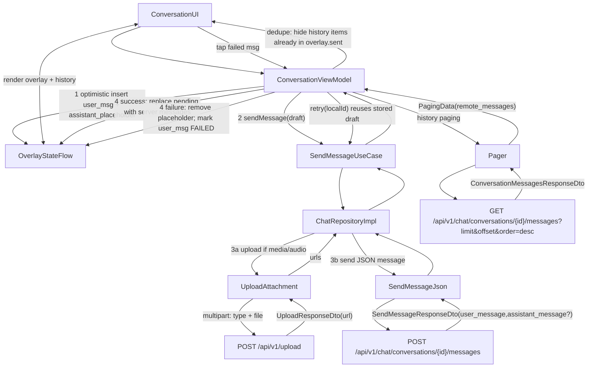

# Chat UI Integration Guide (Yral Mobile)

This document explains how UI developers should integrate the **Chat feature** business logic in `shared/features/chat`, with a focus on **Conversation (chat screen) messages**: paging, sending, retry, and attachment handling.

It follows the API behavior described in [`message_types.md`](https://gist.github.com/kevin-antony-yral/94360fe6923ecd7d02bf03b51c10dbf2).

## Key concepts

- **Paging**: messages are fetched with `order=desc` (latest first). UI scrolls downward to load older messages.
- **Optimistic send**: UI shows the outgoing user message immediately with a sending state and shows an assistant “loading” placeholder while the API call is in-flight.
- **Retry**: if send fails, the message becomes `FAILED`. Tapping it triggers retry, which re-sends the stored draft and shows the loading placeholder again.
- **Attachments**: for now (small images + short audios), UI should **persist attachments to app cache** and send them as `FilePathChatAttachment` so retry is stable.

## ViewModels you will use

### Conversation list (chat wall “inbox”)
- `ChatConversationsViewModel`
  - `val conversations: Flow<PagingData<Conversation>>`
  - `fun setInfluencerFilter(influencerId: String?)`

### Conversation screen (messages)
- `ConversationViewModel`
  - `fun setConversationId(id: String)`
  - `val history: Flow<PagingData<ConversationMessageItem>>`
    - paged server history (latest first), with dedupe against newly sent items
  - `val overlay: StateFlow<List<ConversationMessageItem>>`
    - local optimistic messages + assistant placeholder + newly-sent server messages
  - `fun sendMessage(draft: SendMessageDraft)`
  - `fun retry(localUserMessageId: String)`

`ConversationMessageItem` is a sealed type:
- `Remote(message: ChatMessage)` (server message)
- `Local(message: LocalMessage)` (optimistic/pending message)

## Message send flow (what UI should expect)

### 1) UI calls `sendMessage(draft)`
Immediately, `overlay` receives:
- a local **user** message with `status=SENDING`
- an assistant **placeholder** message (used to show a loading bubble)

### 2) Shared layer performs “upload-first → send JSON”
For non-text messages, shared code follows the doc flow:
- Upload attachment(s) → get URL(s)
- Send message JSON with `media_urls` / `audio_url`

Important:
- **Request `message_type` must be lowercase** (`text`, `image`, `multimodal`, `audio`).
- Response `message_type` may be uppercase; shared layer parses it.

### 3) Success
When the API returns:
- remove the local pending user + placeholder
- add server `user_message`
- add server `assistant_message` if present

### 4) Failure
When the call fails:
- remove assistant placeholder
- mark the user local message as `FAILED` (and keep its draft for retry)

### 5) Retry
When UI calls `retry(localUserMessageId)`:
- the local message flips back to `SENDING`
- a new assistant placeholder is inserted
- the API call is performed again using the stored draft

## Data flow diagram (Conversation messages)



## Attachment integration (recommended for small images + short audio)

### Why persist to cache?
Pickers often return temporary/permission-scoped handles (`content://` on Android, security-scoped on iOS). For retry to work reliably, persist to app cache and upload from a normal file path.

### Android: from `Uri` (gallery/camera)
Use:
- `persistUriToChatCache(context, uri, contentTypeOverride?, fileNameOverride?)`

Example:

```kotlin
val attachment = persistUriToChatCache(
    context = context,
    uri = pickedUri,
    contentTypeOverride = "image/jpeg",
)

val draft = SendMessageDraft(
    messageType = ChatMessageType.IMAGE,
    mediaAttachments = listOf(attachment),
)
conversationViewModel.sendMessage(draft)
```

### iOS: from `NSURL` (picker/camera temp file)
Use:
- `persistUrlToChatCache(url, contentTypeOverride?, fileNameOverride?)`

### Cleanup (after success)
After the message is successfully sent (upload + send JSON succeeded), delete the cached file:
- `FilePathChatAttachment.deleteCachedFile()`

If the send fails, keep the cached file so retry can reuse it.

## Notes for UI rendering

- **Ordering**: API returns latest-first (`order=desc`). Keep UI list in the same order for consistent paging behavior.
- **Local items**: render `ConversationMessageItem.Local` using:
  - `LocalMessage.status` (SENDING/FAILED)
  - `LocalMessage.isPlaceholder` (assistant typing bubble)
- **Role**: server role is mapped to `ConversationMessageRole` (USER/ASSISTANT).

